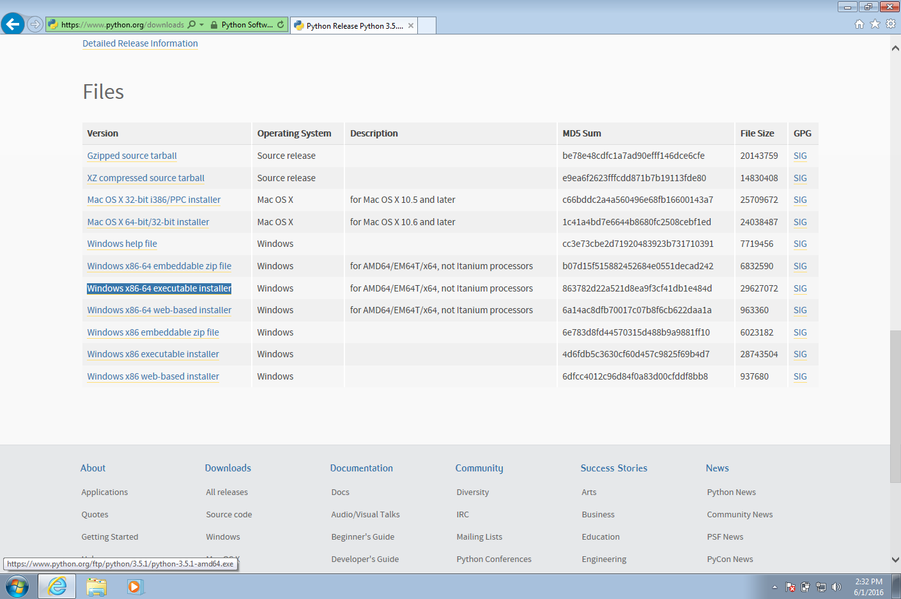

# Python

The programming language we'll be learning in this course is [Python](https://www.python.org).

It is an interpreted language.
You save your source in a `.py` file and a special program called the **interpreter** knows how to run that file.

## Install

### OS X

First, install [Homebrew](http://brew.sh).
It's a package manager that allows you to install other command line tools very easily.
We'll use it a few times later in the class as well.

Then, install Python 3 and setup the Python command.

```bash
brew install python3
echo "alias python='python3'" >> .bashrc
echo "alias python2='\python'" >> .bashrc
alias python='python3'
alias python2='\python'
```

### Windows 7

[Download](https://www.python.org/downloads/) the Python 3 installer and run it.





## Running

Once you've installed Python, you should be able to run Python source files.

```bash
~ $ python -V
Python 3.5.1
```

Also check that you can run PIP.

```bash
~ $ pip -V
pip 8.1.2 from /usr/local/lib/python3.5/site-packages (python 3.5)
```
